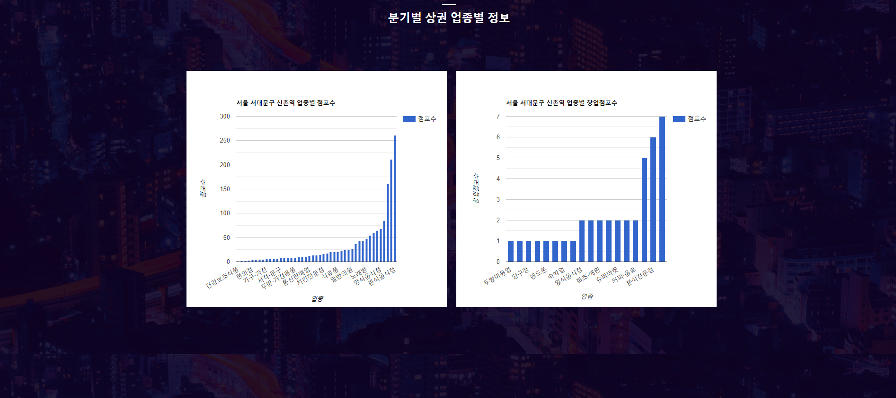
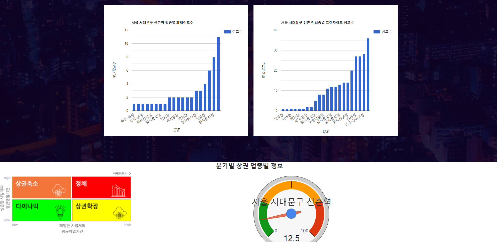

# CommercialAreaAnalysis
서울시상권분석(분기별, 지역별 추정유동인구, 소득/소비, 직장인/상주인구, 추정 매출) 미니 프로젝트
제공 데이터 API 별로 구글 차트를 활용하여 시각화 시도
구별/ 상권 카테고리별/ 상권명별 차트 제공

# 팀원
강민웅 [강민웅님의 깃허브 바로가기](https://github.com/happymwkang) 
최성국 [최성국님의 깃허브 바로가기](https://github.com/SunggookCHOI)
 
# 프로젝트 일정관리
[일정관리 바로가기](https://docs.google.com/spreadsheets/d/1p9sHOLvmWk5g7zUIAiSGgGvTzAly3Am9OeQ8GipO2Hs/edit#gid=1321741680)

# 사용 기술셋
RDBMS : Oracle  
Development Language : java / servlet / sql  
Library: Lombok, Maven  
Web Development : JSP / ajax / java script / HTML / CSS   
Tool : Google Chart   

# 개발 환경

Window 10
Eclipse Java EE IDE for Web Developers Version: Photon Release (4.8.0)  

# 소스가 실행 되려면?
1. Eclips에서 start.jsp 파일을 Start합니다.
2. 분석을 시작합니다.

# 페이지 미리보기

### Main 
</img>
1. 구선택시 구가 보유중인 상권 카테고리를 select박스 형태로 제공  
2. 상권 카테고리 선택시 카테고리가 보유중인 상권명을 select박스 형태로 제공  
3. 상권명까지 선택한후 Search를 누르면 해당 상권의 데이터를 기반으로 차트제공.

### 차트

</img>
</img>

# 가설설정

# 결론

# 향후 추가 되었으면 하는 것은?

# 출처
### 그래프

Google / AnyChart

### 데이터

서울시 열린 데이터 광장
